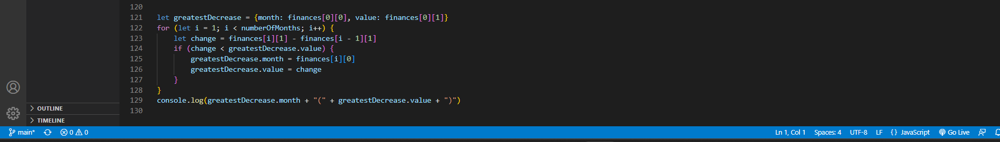

# Console-Finances

## Project
This project entailed using concepts of foundational Javascript learnt. Utilising arrays, loops etc.. to createcode for analysing the financial records of a company.

## Acceptable Criteria
The task as mentioned before was to write Javascript code that examines the financial records of a company. We were given a dataset composed of arrays with two fields, Date and Profit/Losses.

 

With this code we had to calculate the following:-

1. The total number of months included in the dataset.
2. The net total amount of Profit/Losses over the entire period.
3. The average of the changes in Profit/Losses over the entire period (tracking what the total change in the profits are from month to month and then finding the average of that).
4. The greatest increase in profits (date and amount) over the entire period.
5. The greatest decrease in profits (date and amount) over the entire period.

## Outcome
This project was very challenging as I am very new to Javascript, however with a lot of help I was able to achieve everything set out in the acceptable criteria, and they are:-

1. I was able to find the total number of months included in the dataset

   

2. And then progress to finding out the net total amount of Profit/Losses over the entire period.

   

3. The average of the changes in Profit/Losses over the entire period, was found.

   

4. Lastly, I was able to find the greatest 'Increase' and greates 'Decrease' in profits and losses over the entire period.

   

   

## License
Copyright (c) 2022 JayClay922

Permission is hereby granted, free of charge, to any person obtaining a copy of this software and associated documentation files (the "Software"), to deal in the Software without restriction, including without limitation the rights to use, copy, modify, merge, publish, distribute, sublicense, and/or sell copies of the Software, and to permit persons to whom the Software is furnished to do so, subject to the following conditions:

The above copyright notice and this permission notice shall be included in all copies or substantial portions of the Software.

THE SOFTWARE IS PROVIDED "AS IS", WITHOUT WARRANTY OF ANY KIND, EXPRESS OR IMPLIED, INCLUDING BUT NOT LIMITED TO THE WARRANTIES OF MERCHANTABILITY, FITNESS FOR A PARTICULAR PURPOSE AND NONINFRINGEMENT. IN NO EVENT SHALL THE AUTHORS OR COPYRIGHT HOLDERS BE LIABLE FOR ANY CLAIM, DAMAGES OR OTHER LIABILITY, WHETHER IN AN ACTION OF CONTRACT, TORT OR OTHERWISE, ARISING FROM, OUT OF OR IN CONNECTION WITH THE SOFTWARE OR THE USE OR OTHER DEALINGS IN THE SOFTWARE.

## Deployed Application
The deployed applicaltion can be found at:
